# GrokBot Office Website

<p align="center">
  <picture>
    <source media="(prefers-reduced-motion: reduce)" srcset="assets/hero/hero-reduced.svg">
    <source media="(prefers-color-scheme: light)" srcset="assets/hero/hero-light.svg">
    
  </picture>
</p>

<p align="center">
  <picture>
    <source media="(prefers-reduced-motion: reduce)" srcset="assets/hero/computational-dark.svg">
    <source media="(prefers-color-scheme: light)" srcset="assets/hero/computational-light.svg">
    
  </picture>
</p>

> **GrokBot should run your workforce. It shouldn't be your entire workforce.**

This repository contains the public Next.js website for the GrokBot Office workforce architecture. It explains how a small persistent GrokBot supervisor core, AgentOS, and replaceable workers divide responsibility.

The site is a reference, not a live workforce console. Its diagrams and role data are sanitized reference material; they do not claim live workers, paid usage, private accounts, or autonomous execution.

## Source repositories

- [GrokBot Office](https://github.com/M4G3LL4N0/grokbot-office) — workforce registry and control-layer package.
- [AgentOS](https://github.com/M4G3LL4N0/agentos) — provider-neutral execution and orchestration substrate.
- [Website source](https://github.com/M4G3LL4N0/grokbot-office-website) — this site.

## What the site explains

- the supervisor → AgentOS → worker architecture;
- the 134 conceptual roles, 3 reference supervisors, and 131 virtual roles;
- the north star: verified useful output divided by total resource cost;
- the evidence, cache, verifier, coach, and learning loop;
- security boundaries and the difference between a role and a bot.

The site does not include private state, credentials, browser sessions, account exports, harvested material, or machine-specific paths.

## Local development

```bash
git clone https://github.com/M4G3LL4N0/grokbot-office-website.git
cd grokbot-office-website
pnpm install --frozen-lockfile
pnpm dev
```

Open `http://localhost:3000` for the local site. `NEXT_PUBLIC_SITE_URL` is optional for local development; set it to the real deployed origin only after a deployment exists so metadata, robots, and sitemap URLs remain truthful.

## Verification

```bash
pnpm install --frozen-lockfile
pnpm lint
pnpm typecheck
pnpm test
pnpm build
```

The production build has no required secrets and no deployment workflow. `pnpm build` generates the sanitized workforce subset from the checked-in reference data.

## Routes

- `/` — north star, architecture thesis, interactive control map, and learning loop.
- `/architecture` — supervisor, AgentOS, worker, and evidence boundaries.
- `/efficiency` — cache, triage, and smallest-capable-team model.
- `/workforce` — role explorer and count semantics.
- `/learning` — verification, coach, lesson, and reuse loop.
- `/security` — identity, credentials, approvals, and public packaging.
- `/docs` — canonical documentation index and source links.
- `/roadmap` — deliberate next steps.

Unknown routes render the accessible 404 page. The site includes skip navigation, visible focus states, semantic labels for interactive controls, reduced-motion handling, metadata, Open Graph/Twitter images, a manifest, robots metadata, and a sitemap.

## Contributing and security

Read [`CONTRIBUTING.md`](CONTRIBUTING.md) before changing the site. Do not add credentials, private state, personal information, deployment secrets, or unverified metrics. See [`SECURITY.md`](SECURITY.md) for reporting and boundaries.

## License

MIT. See [`LICENSE`](LICENSE).

<!-- TRILLIONX:presentation:begin -->

### Animated surfaces

Generated from this repository's own source tree: every count, route and module below was measured, not written by hand.

#### Identity

<picture>
  <source media="(prefers-reduced-motion: reduce)" srcset="https://raw.githubusercontent.com/M4G3LL4N0/grokbot-office-website/main/.github-art/surfaces/hero-reduced.svg">
  <source media="(prefers-color-scheme: light)" srcset="https://raw.githubusercontent.com/M4G3LL4N0/grokbot-office-website/main/.github-art/surfaces/hero-light.svg">
  
</picture>

#### Modules

<picture>
  <source media="(prefers-reduced-motion: reduce)" srcset="https://raw.githubusercontent.com/M4G3LL4N0/grokbot-office-website/main/.github-art/surfaces/architecture-reduced.svg">
  <source media="(prefers-color-scheme: light)" srcset="https://raw.githubusercontent.com/M4G3LL4N0/grokbot-office-website/main/.github-art/surfaces/architecture-light.svg">
  
</picture>

#### Routes

<picture>
  <source media="(prefers-reduced-motion: reduce)" srcset="https://raw.githubusercontent.com/M4G3LL4N0/grokbot-office-website/main/.github-art/surfaces/data_flow-reduced.svg">
  <source media="(prefers-color-scheme: light)" srcset="https://raw.githubusercontent.com/M4G3LL4N0/grokbot-office-website/main/.github-art/surfaces/data_flow-light.svg">
  
</picture>

#### Primitives

<picture>
  <source media="(prefers-reduced-motion: reduce)" srcset="https://raw.githubusercontent.com/M4G3LL4N0/grokbot-office-website/main/.github-art/surfaces/state_machine-reduced.svg">
  <source media="(prefers-color-scheme: light)" srcset="https://raw.githubusercontent.com/M4G3LL4N0/grokbot-office-website/main/.github-art/surfaces/state_machine-light.svg">
  
</picture>

#### Composition

<picture>
  <source media="(prefers-reduced-motion: reduce)" srcset="https://raw.githubusercontent.com/M4G3LL4N0/grokbot-office-website/main/.github-art/surfaces/component_map-reduced.svg">
  <source media="(prefers-color-scheme: light)" srcset="https://raw.githubusercontent.com/M4G3LL4N0/grokbot-office-website/main/.github-art/surfaces/component_map-light.svg">
  
</picture>

#### Build and tests

<picture>
  <source media="(prefers-reduced-motion: reduce)" srcset="https://raw.githubusercontent.com/M4G3LL4N0/grokbot-office-website/main/.github-art/surfaces/build-reduced.svg">
  <source media="(prefers-color-scheme: light)" srcset="https://raw.githubusercontent.com/M4G3LL4N0/grokbot-office-website/main/.github-art/surfaces/build-light.svg">
  
</picture>

#### Workflow

<picture>
  <source media="(prefers-reduced-motion: reduce)" srcset="https://raw.githubusercontent.com/M4G3LL4N0/grokbot-office-website/main/.github-art/surfaces/workflow-reduced.svg">
  <source media="(prefers-color-scheme: light)" srcset="https://raw.githubusercontent.com/M4G3LL4N0/grokbot-office-website/main/.github-art/surfaces/workflow-light.svg">
  
</picture>

#### Domain

<picture>
  <source media="(prefers-reduced-motion: reduce)" srcset="https://raw.githubusercontent.com/M4G3LL4N0/grokbot-office-website/main/.github-art/surfaces/domain-reduced.svg">
  <source media="(prefers-color-scheme: light)" srcset="https://raw.githubusercontent.com/M4G3LL4N0/grokbot-office-website/main/.github-art/surfaces/domain-light.svg">
  
</picture>

#### Identity object

<picture>
  <source media="(prefers-reduced-motion: reduce)" srcset="https://raw.githubusercontent.com/M4G3LL4N0/grokbot-office-website/main/.github-art/surfaces/footer-reduced.svg">
  <source media="(prefers-color-scheme: light)" srcset="https://raw.githubusercontent.com/M4G3LL4N0/grokbot-office-website/main/.github-art/surfaces/footer-light.svg">
  
</picture>

<!-- TRILLIONX:presentation:end -->

<!-- TRILLIONX:evidence:begin -->

## What is measurable here

Generated by `.github-art` from the source tree at publish time.

| Signal | Value |
| --- | --- |
| HTTP routes | 8 |
| Entry points | 0 |
| Module roots | 3 |
| Test files | 1 |
| CI workflows | 1 |
| Distinctive stack | scaffold only |
| Status | TESTED |
| Evidence confidence | E3 |
| Animated surfaces | 9 |

<!-- TRILLIONX:evidence:end -->
